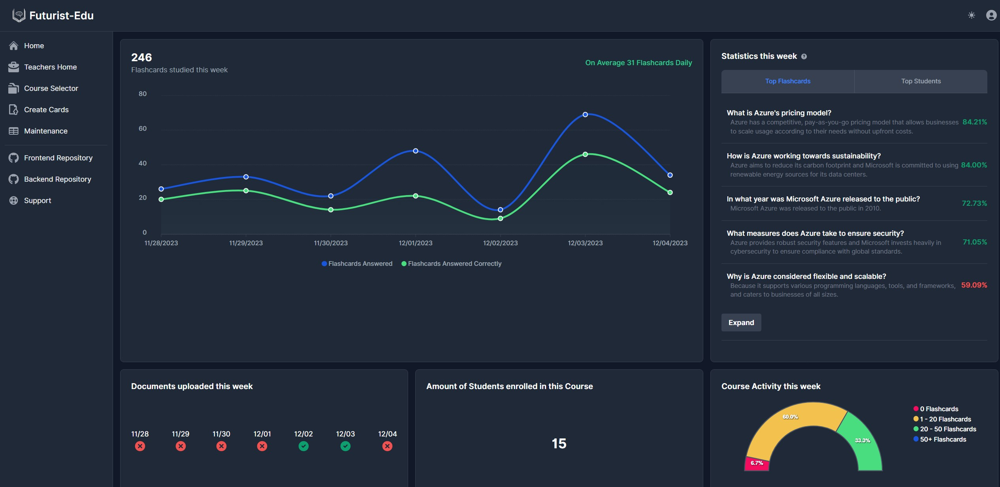
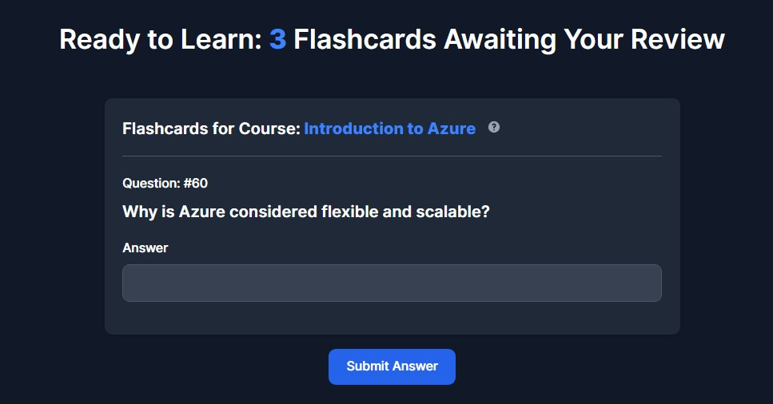
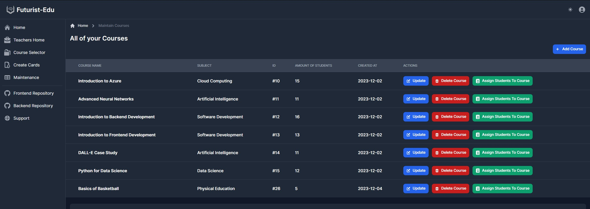
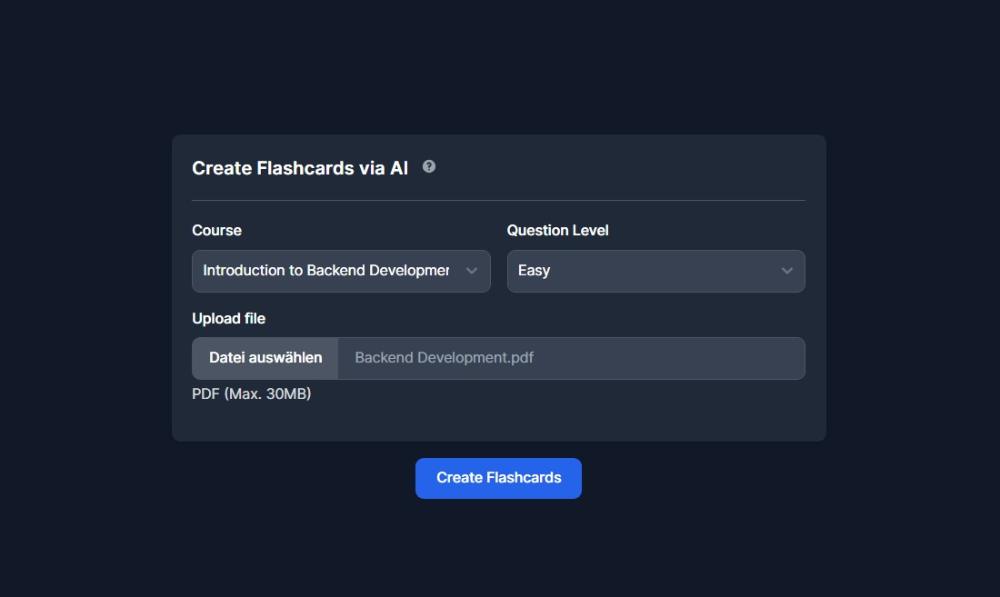

# Futurist-Edu

  

Futurist-Edu is an innovative, AI-driven educational platform that leverages Azure AI and Azure Data Services to revolutionize the way students learn. Our goal is to make learning more efficient, interactive, and tailored to individual needs.

## Features

- **AI-Generated Flashcards:** Automatically creates learning flashcards from uploaded documents using Azure Document Intelligence and OpenAI API.
- **Teacher Dashboard:** Intuitive interfaces for teachers to create, manage courses, and for students to engage with the learning material.
- **Advanced Analytics:** Monitors student progress and question effectiveness, offering insights to both students and educators.
- **Seamless Integration:** Utilizes Azure SQL for robust data management and Azure Functions for a scalable backend.

## Project Structure

- **Frontend Folder:** Contains all frontend code, built using Astro.
- **Backend Folder:** Houses the Node.js code for Azure Functions.

## Screenshots

### Teacher's Dashboard Analytics
 
### Student's View of a Flashcard
 
### Course Maintenance Interface
 
### Document Upload for Flashcard Generation
 

## Usage

- **For Teachers:** Upload your course materials, and let Futurist-Edu generate and manage interactive flashcards.
- **For Students:** Engage with AI-generated flashcards, receive instant feedback, and enjoy your learning progress.

## License

This project is licensed under the [MIT License](https://opensource.org/licenses/MIT) - see the [LICENSE](./LICENSE) file for details.
